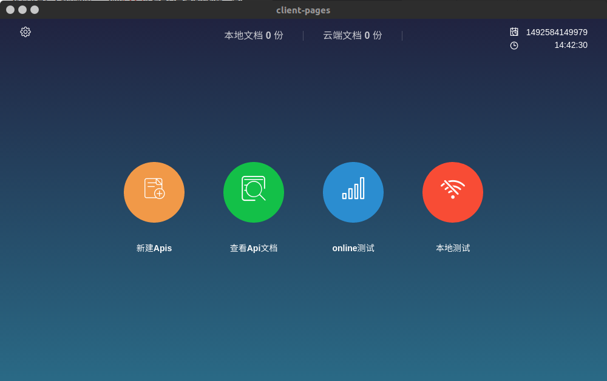

# courseDesign

- 基于nodejs + electron + vue(全家桶) + mongodb 的一个前后端Api管理工具...

```
	git clone https://github.com/lastIndexOf/courseDesign.git

	cd courseDesign

	npm i
	or
	yarn install

	....

	运行命令
	yarn start

	打包命令
	yarn run build

```

[数据库设计](https://github.com/lastIndexOf/ApiManager/tree/master/docs/sql)


